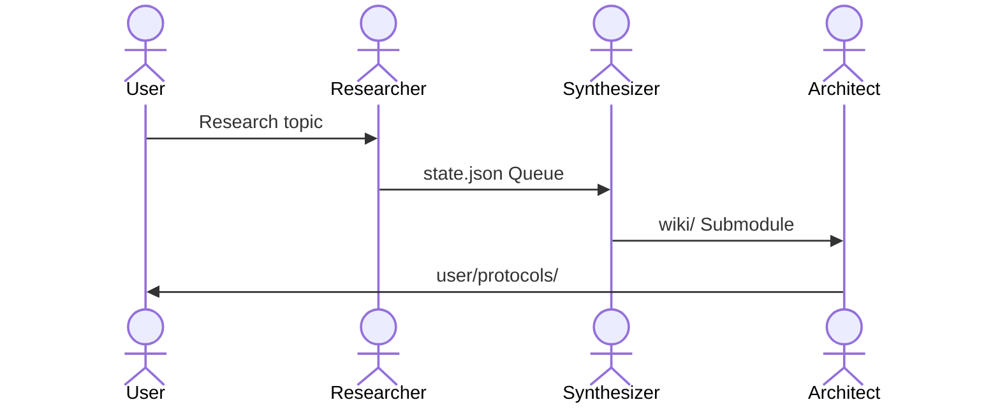

# Agentic Wiki Builder: Agent Architecture & Philosophy

The Agentic Wiki Builder is designed around a **filesystem-driven, evidence-based agent architecture**. Rather than relying on a centralized orchestration framework or runtime memory, agents coordinate asynchronously using the repository's files and git submodules as a decoupled, declarative state-sharing layer.

---

## 1. Core Agent Personas

Agents operate as functional layers of the evidence-to-action pipeline, each binding to specific MCP servers and workspace submodules:

*   **Researcher** (`research-agent` / `google-drive-agent`)
    *   **Core Role:** Discovers literature or internal documentation, downloads PDFs, and enqueues raw source materials.
    *   **Tooling Binding:** 
        *   `research-mcp` for academic paper searches (`search_literature`), automatic PDF download & text extraction (`download_paper`), and queue manipulation (`queue_enqueue`).
        *   `google-drive-mcp` for listing and downloading internal docs/sheets (`gdrive_list_files`, `gdrive_download_file`).
    *   **Submodule Workspace:** Writes raw files and metadata under `sources/literature/` and `sources/internal_documentation/`.

*   **Synthesizer** (`synthesis-agent`)
    *   **Core Role:** Ingests raw staged sources from the queue and translates them into an objective, anonymous, footnoted knowledge base.
    *   **Tooling Binding:** 
        *   `wiki-mcp` for querying historical context (`wiki_query`, `wiki_vsearch`, `wiki_search`), rebuilding search indices (`wiki_update_index`), and running validation checks (`lint_check_links`).
        *   `research-mcp` for listing and dequeuing queue items (`queue_list`, `queue_dequeue`).
    *   **Submodule Workspace:** Strictly reads from `sources/`, writes to the objective `wiki/` submodule, and updates `state.json`.

*   **Protocol Architect** (`protocol-agent`)
    *   **Core Role:** Translates anonymized wiki knowledge and user-specific feedback or constraints into actionable protocols.
    *   **Tooling Binding:** 
        *   `wiki-mcp` for retrieving scientific backing (`wiki_query`, `wiki_vsearch`) and validating protocol links (`lint_check_links`, `wiki_update_index`).
    *   **Submodule Workspace:** Reads from `wiki/` and `user/profile.md`, writes tailored instructions to the `user/protocols/` submodule.

*   **Auditor / Fact Checker** (`audit-agent`)
    *   **Core Role:** Validates internal/external claims, audits citations, ensures structural integrity, and manages financial assets.
    *   **Tooling Binding:** 
        *   `wiki-mcp` for reference audits (`lint_check_links`, `wiki_query`) and backing-up metadata (`lint_backup_sources`).
        *   `research-mcp` for external verification searches (`search_literature`).
        *   `finance-mcp` for running calculations (`calc_*`), fetching market data (`stock_*`), and tracking expenses (`expense_*`).
    *   **Submodule Workspace:** Audits entire workspace (runs validation in `wiki/` and `user/`), updates `user/finance/transactions.csv`.

---

## 2. Filesystem-Driven Handoff Model

Agent coordination is fully asynchronous, stateless, and mediated by files and git submodules. MCP tools provide the API layer to interact with this structure:

*   **Staging (`sources/`)**: Ground for raw evidence. Populated by `download_paper` and `gdrive_download_file` with `original.pdf`, `raw.md` (fully extracted text via MarkItDown), and `metadata.md` (bibliographical info).
*   **Manifest (`state.json`)**: Orchestration queue for pending ingestion. Read/write operations are exposed by `queue_list`, `queue_enqueue`, and `queue_dequeue` from `research-mcp` or read via the `research://state` resource.
*   **Wiki (`wiki/` submodule)**: Objective knowledge base (anonymized, theory-focused). Queried via `wiki_query`, `wiki_vsearch`, and `wiki_search`. All updates require index rebuilding via `wiki_update_index` and link checking via `lint_check_links`.
*   **User Workspace (`user/` submodule)**: Personalized deliverables (user profiles, feedback, actionable protocols) and private metrics (financial records). Checked using `lint_check_links` to prevent reference drift.

---

## 3. Strict Conventions & Rules of Engagement

### Hierarchy of Evidence & Citation
*   **Citations**: Protocols cite the Wiki (`wiki/`); the Wiki cites Sources (`sources/`).
*   **Format**: Use `markdown-it` footnotes (`[^1]`) and relative markdown links (`[Text](../path.md)`). Never use inline URLs, external links, or `[[wikilinks]]`.
*   **Naming**: Use `snake_case.md` for all files.

### Evidence & Truth
*   **No Fabrication**: Do not invent sources, quotes, or metadata. If verified source evidence is missing, halt and request the raw document.
*   **No Stubs**: Skip sources with `status: stub` or failed extraction.
*   **No Web Search**: Discover literature using dedicated research tools; never search the web directly.

### Separation of Responsibilities
*   **Wiki (Objective)**: Must remain anonymous and objective. Present competing hypotheses with confidence markers (`> ⚠️`). Do not include user-specific data.
*   **Protocols (Actionable)**: Personalized, step-by-step instructions. Cite the Wiki for backing, but omit scientific justifications within the protocol itself.
*   **User Profile**: Persist only structural, recurring traits (goals, constraints, physiology). Never save anecdotal one-off events.

### Workspace Structure & Version Control
*   **Submodule Isolation**: The `wiki/` and `user/` directories are independent git submodules. The `sources/` directory is a standard folder containing specific submodules: `sources/raw/` (utilizing Git LFS to track raw PDF and binary source files) and individual code or internal documentation project submodules (e.g., `sources/internal_documentation/hpdsa_documents`). Commits must be made directly within the submodules (including `sources/raw/` when staging files) to serve as a status log of agent operations.
*   **Code Repositories**: Project code repositories must be cataloged in [repositories.md](sources/code/repositories.md). External repositories must NOT be cloned locally in the workspace unless they are specifically needed to compile, run tests, or benchmark the code. To verify branch state, refs, tags, or commit existence without local cloning, agents must use `git ls-remote <Repository URL>` or similar remote inspection queries. If local cloning is required for running/benchmarking, clone it temporarily within the git-ignored `sources/code/` directory and clean up or keep it git-ignored.
*   **Index Catalogs**: Every directory must contain an `_index.md` listing its contents with one-line summaries. Do not place task/progress markers in index catalogs.
*   **Folder Bloat Limit**: Maximum of 15 content files per directory (excluding `_index.md`). Restructure into subdirectories when this limit is exceeded.
*   **YAML Frontmatter**: Every non-index markdown file in `wiki/` and `user/` must begin with a standardized YAML frontmatter containing `title`, `category` (relative directory path under collection root), `related` (list of linked internal relative files), and `rationale` (concise single-sentence design philosophy/organizational justification). This frontmatter is validated by `lint_check_links` and is indexed for search via `wiki_update_index`.

---

## 4. Behavioral Principles

*   **Verify Before Synthesis**: Confirm source extraction is successful and contains content before citing. State assumptions explicitly.
*   **Simplicity and Conciseness**: Synthesize the minimum required text. Protocols must contain only the necessary actionable steps. Avoid speculative padding.
*   **Surgical Edits**: Touch only the files and lines required for the task. Do not make cosmetic edits to adjacent sections. Clean up orphaned links or footnotes created by your changes.
*   **Goal-Driven Execution**: Define validation criteria (e.g., link integrity, index updates) before starting a task and verify them iteratively until they pass.
