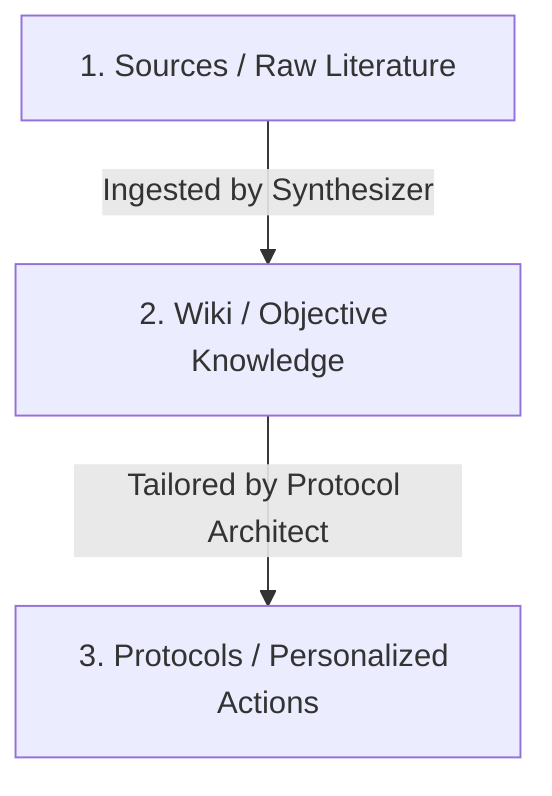

# Agentic Wiki Builder

A modular, evidence-based system that automates the transformation of raw information (such as scientific literature, data, and documents) into a structured knowledge base (Wiki) and translates it into personalized, actionable guidelines (Protocols).

The architecture is entirely **filesystem-driven** and framework-agnostic. Multiple agents (or a single agent playing multiple roles) coordinate asynchronously by writing state changes to the filesystem and git submodules.

---

## 🚀 The Workflow Pipeline

Evidence progresses through a strict pipeline with a formal **Hierarchy of Evidence**:



1. **Research (Source Discovery):** Discovers literature or internal data, stages files in `sources/`, and logs items in `state.json`.
2. **Ingest (Synthesis):** Compiles and resolves raw source material into the objective, anonymized `wiki/` knowledge base.
3. **Build Protocol (Actionable Output):** Adapts objective Wiki knowledge to a user's specific goals, constraints, and physiological parameters in `user/protocols/`.

---

## 📁 Repository Structure

```text
├── .agents/          # Agent scripts, tools, and execution packages (skills)
│   ├── mcp/          # Model Context Protocol (MCP) servers (wiki, research, finance)
│   └── skills/       # Action packages (ingest, build-protocol, fact-check)
├── sources/          # Unified staging area for all raw inputs (literature, code, docs)
├── wiki/             # Git Submodule: Synthesized, objective knowledge base (anonymized)
├── user/             # Git Submodule: Personal profile, feedback, and active protocols
└── state.json        # Central execution manifest & ingestion queue
```

---

## 🛠 Features & Capabilities

* **Asynchronous Handoffs**: Coordination mediated completely by `state.json` and index updates. No active runtime orchestration is required.
* **Model Context Protocol (MCP)**: Native servers (`research-mcp`, `wiki-mcp`, `finance-mcp`) allow LLMs to query databases, search literature, and run portfolio math.
* **Hermetic Submodules**: The `wiki/` and `user/` directories are decoupled git submodules to ensure clear boundaries between objective knowledge and user-private context.

---

## ⚙️ Installation & Setup

Follow these steps to set up the project locally:

### 1. Clone the Repository
Clone the repository along with its submodules:
```bash
git clone --recursive https://github.com/XicuM/agentic-wiki-builder.git
cd agentic-wiki-builder
```

### 2. Configure Environment & Dependencies
Create a virtual environment and install the required dependencies:
```bash
python -m venv .venv
source .venv/bin/activate
pip install -r requirements.txt
```

Set up your environment variables by copying the template file:
```bash
cp .example.env .env
```
Open `.env` and fill in your API credentials (e.g., `SEMANTIC_SCHOLAR_API_KEY`).

### 3. Connect MCP Servers to your Agent / IDE
The project defines three MCP servers in `opencode.json`. The servers auto-detect the project root (via `state.json`) and use relative Python paths — no manual path editing required if you use opencode.

If using Claude Desktop, create equivalent entries referencing your local `.venv/bin/python` and `.agents/mcp/*/server.py` paths.

### 4. Run the Test Suite
Ensure the dependencies and local MCP servers are working correctly by running the tests:
```bash
pytest
```

---

## 📱 Mobile Integration (OpenClaw)

This workspace can be integrated with mobile-friendly agent frontends like **OpenClaw** (e.g., via Telegram). 

To install this workspace as an autonomous skill, send this prompt to your OpenClaw-backed agent:
> "Clone this repository: `https://github.com/XicuM/agentic-wiki-builder.git`. Keep the work for this project scoped to this workspace only. Install the skills in your main workspace. After install, inspect the project structure and help me finish setup. Ask before making any broader changes."
