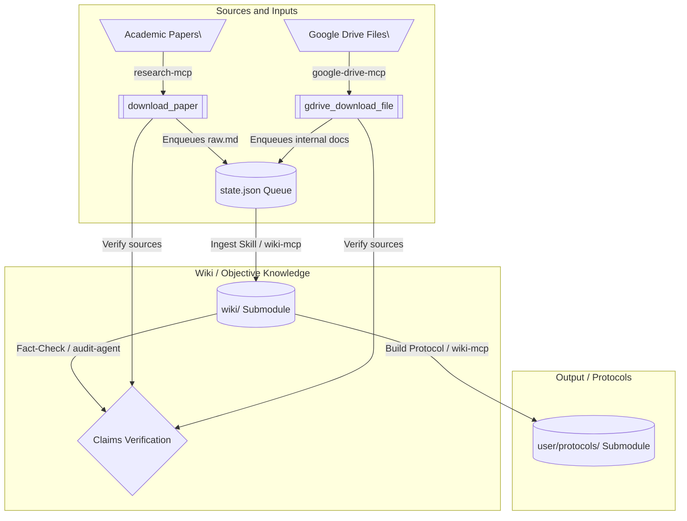

# Agentic Wiki Builder

A modular, evidence-based system that automates the transformation of raw information (such as scientific literature, data, and documents) into a structured knowledge base (Wiki) and translates it into personalized, actionable guidelines (Protocols).

The architecture is entirely **filesystem-driven** and framework-agnostic. Multiple agents (or a single agent playing multiple roles) coordinate asynchronously by writing state changes to the filesystem and git submodules.

---

## 🚀 The Workflow Pipeline

Evidence progresses through a strict, tool-supported pipeline with a formal **Hierarchy of Evidence**, powered by custom Model Context Protocol (MCP) servers and localized skills.



### 1. Source Discovery & Queueing (`research-mcp` & `google-drive-mcp`)
* **Discovery:** The **Researcher** discovers academic papers via the `search_literature` tool (queries PubMed, OpenAlex, arXiv, Semantic Scholar, etc.) or searches internal files on Google Drive via `gdrive_list_files`.
* **Download & Extraction:** The paper is downloaded using the `download_paper` tool (or `gdrive_download_file` for internal documents). 
  - The PDF is fetched and text is extracted using `markitdown` to create a `raw.md` text document.
  - A bibliographic markdown summary `metadata.md` is generated.
  - The files are written under `sources/literature/<domain>/<filename_base>/` (or `sources/internal_documentation/`).
* **Manifest Entry:** The tool automatically enqueues the item as `"status": "pending"` in the master ingestion manifest `state.json`. Alternatively, the agent can manually use `queue_enqueue`.

### 2. Wiki Ingestion & Synthesis (`wiki-mcp` & `research-mcp`)
* **Queue Ingestion:** The **Synthesizer** checks the manifest queue via the `queue_list` tool (or reads the `research://state` resource) to find pending items.
* **Context Retrieval & Integration:** The agent reads the extracted `raw.md`, then queries the existing wiki using `wiki-mcp` search tools (`wiki_query`, `wiki_vsearch`, `wiki_search`) to contextually relate findings.
* **Synthesis:** The agent updates or creates objective, anonymized files in the `wiki/` submodule, ensuring:
  - Statements are footnoted (using `markdown-it` footnotes `[^1]`) back to `sources/`.
  - Confidence callouts (`> ⚠️`) specify the level of consensus.
  - Metadata is saved in standard YAML frontmatter.
* **Validation & Queue Cleanup:** The agent updates the domain's `_index.md`, rebuilds the vector/semantic search database using `wiki_update_index`, and validates page formatting/links using `lint_check_links`. Once successful, the agent marks the item complete and removes it from the queue using `queue_dequeue`.

### 3. Protocol Design & Tailoring (`wiki-mcp`)
* **Adaptation:** The **Protocol Architect** designs step-by-step actionable protocols inside `user/protocols/` based on the user's traits (`user/profile.md`) and compliance feedback (`user/feedback.md`).
* **Scientific Grounding:** The agent retrieves backing science from the wiki using `wiki_query`/`wiki_vsearch` and footnotes every recommendation to the relative `wiki/` note path.
* **Validation:** The agent runs `wiki_update_index` and `lint_check_links` on `user/` to verify structural constraints.

### 4. Verification & Auditing (`wiki-mcp` & `research-mcp`)
* **Fact-Checking:** When auditing user requests or workspace updates, the **Auditor** breaks the text into atomic claims and verifies them against the wiki (using `wiki_query`) and literature (using `search_literature`).
* **Validation Audits:** Automated link, footnote, folder-bloat, and YAML checks are run on-demand using `lint_check_links` to prevent reference drift.

### 5. Financial Calculation & Tracking (`finance-mcp`)
* **Calculation:** Provides compound annual growth rate calculations (`calc_cagr`), future value projections (`calc_fv`), DCA forecasting (`calc_dca`), and portfolio weights optimization (`calc_weights`).
* **Market Data:** Retrieves stock prices (`stock_price`) and FinBERT sentiment-annotated stock news (`stock_news`).
* **Expense Analysis:** Ingests Trade Republic statement CSV exports (`expense_parse`) into a unified `transactions.csv` file, queries historical/monthly spend patterns (`expense_monthly`, `expense_range`, `expense_top`), and exports monthly summaries (`expense_export_monthly`).

---

## 📁 Repository Structure

```text
├── .agents/          # Agent scripts, tools, and execution packages (skills)
│   ├── mcp/          # Model Context Protocol (MCP) servers (wiki, research, finance)
│   └── skills/       # Action packages (ingest, build-protocol, fact-check)
├── sources/          # Unified staging area for all raw inputs (literature, code, docs)
├── wiki/             # Git Submodule: Synthesized, objective knowledge base (anonymized)
├── user/             # Git Submodule: Personal profile, feedback, and active protocols
└── state.json        # Central execution manifest & ingestion queue
```

---

## 🛠 Features & Capabilities

* **Asynchronous Handoffs**: Coordination mediated completely by `state.json` and index updates. No active runtime orchestration is required.
* **Model Context Protocol (MCP)**: Native servers (`research-mcp`, `wiki-mcp`, `finance-mcp`) allow LLMs to query databases, search literature, and run portfolio math.
* **Hermetic Submodules**: The `wiki/` and `user/` directories are decoupled git submodules to ensure clear boundaries between objective knowledge and user-private context.

---

## ⚙️ Installation & Setup

Follow these steps to set up the project locally:

### 1. Clone the Repository
Clone the repository:
```bash
git clone https://github.com/XicuM/agentic-wiki-builder.git
cd agentic-wiki-builder
```

### 2. Run Automated Git Setup
Run the setup script to configure Git LFS, pull submodules, and automate background pulls/pushes for the team:
```bash
python setup.py
```

### 3. Configure Environment & Dependencies
Create a virtual environment and install the required dependencies:
```bash
python -m venv .venv
source .venv/bin/activate
pip install -r requirements.txt
```

Set up your environment variables by copying the template file:
```bash
cp .example.env .env
```
Open `.env` and fill in your API credentials (e.g., `SEMANTIC_SCHOLAR_API_KEY`).

### 3. Connect MCP Servers to your Agent / IDE
The project defines three MCP servers in `opencode.json`. The servers auto-detect the project root (via `state.json`) and use relative Python paths — no manual path editing required if you use opencode.

If using Claude Desktop, create equivalent entries referencing your local `.venv/bin/python` and `.agents/mcp/*/server.py` paths.

### 4. Run the Test Suite
Ensure the dependencies and local MCP servers are working correctly by running the tests:
```bash
pytest
```

---

## 📱 Mobile Integration (OpenClaw)

This workspace can be integrated with mobile-friendly agent frontends like **OpenClaw** (e.g., via Telegram). 

To install this workspace as an autonomous skill, send this prompt to your OpenClaw-backed agent:
> "Clone this repository: `https://github.com/XicuM/agentic-wiki-builder.git`. Keep the work for this project scoped to this workspace only. Install the skills in your main workspace. After install, inspect the project structure and help me finish setup. Ask before making any broader changes."
